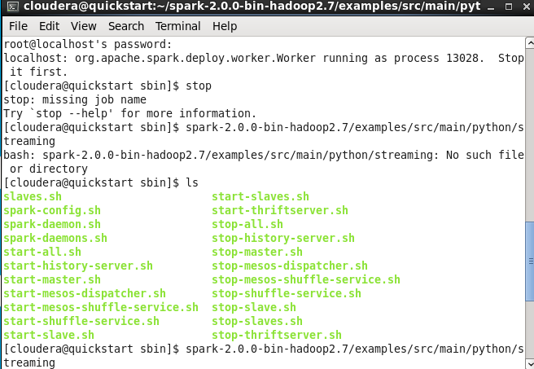
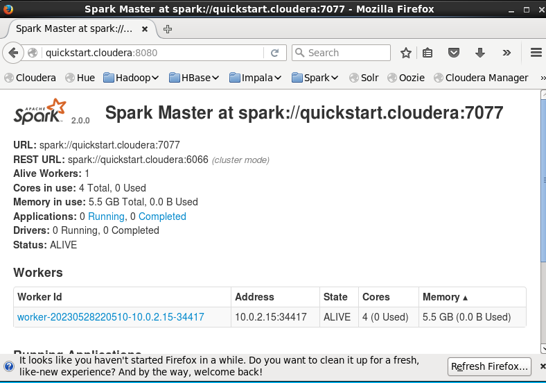
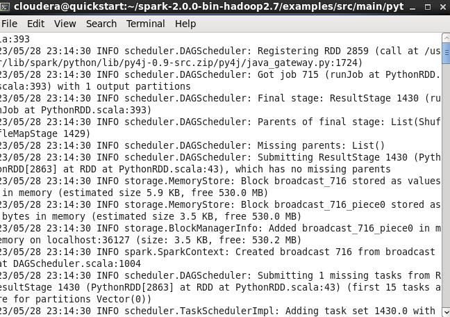

# Praktikum Chapter 5

## Nama : Arya Admaja

## Kelas : TI-3C 

## NIM : 2041720104

# Hasil SS
  
  
  
  
  
  
  
  
  
  
 
# Tugas Praktikum

 - sys.argv : argumen saat program dijalankan. Argumen ini didapatkan dari input user.
 - sys.stderr : objek yang digunakan untuk menampilkan pesan kesalahan / berkaitan dengan keluaran standar kesalahan.
 - StreamingContext : kelas inti dalam modul PySpark Streaming yang digunakan untuk membuat dan mengonfigurasi aplikasi streaming.
 - sc : instansiasi dari objek SparkContext
 - socketTextStream : membuat DStream (Distributed Stream) dari sumber data streaming melalui koneksi socket.
 - reduceByKey : melakukan operasi reduksi pada pasangan kunci-nilai (key-value pairs) dalam RDD.
 - lambda line : sebagai fungsi mapping sederhana hanya dalam satu baris.  
 - awaitTermination : memungkinkan aplikasi streaming tetap berjalan dan memblokir eksekusi hingga secara manual dihentikan atau terjadi kegagalan
 - nc : perintah untuk menjalankan netcat yang berguna untuk membuat, mengirim, dan menerima koneksi jaringan TCP atau UDP
 - lk : opsi dari perintah netcat, dimana (l) berarti listen dan (k) yaitu keep open, yang artinya netcat akan tetap berjalan (melakukan listening) dan terus   
   terbuka.
 - spark-submit : perintah yang digunakan untuk mengirimkan dan menjalankan aplikasi PySpark (aplikasi yang ditulis dalam Python dengan menggunakan Apache Spark)        di dalam cluster Apache Spark.
 - master : menentukan url master dari spark.
 - local[*] : menginstruksikan Spark untuk menjalankan aplikasi PySpark secara lokal pada mesin yang sama. simbol * menunjukkan kepada Spark untuk menggunakan          sebanyak mungkin inti CPU yang tersedia pada mesin tersebut.
 - ssc.checkpoint : mengatur direktori tempat data metadata ssc (StreamingContext) disimpan.
 - parallelize : untuk membuat RDD dari koleksi yang ada di dalam Python.
 - updateStateByKey : mengimplementasikan transformasi stateful pada DStream (Distributed Stream) yang sedang berjalan.
 - flatMap : memproses koleksi data dengan mengaplikasikan sebuah fungsi pada setiap elemen koleksi dan mengembalikan nol atau lebih elemen dalam bentuk yang            datar. 
 - rdd.take(5) : mengambil jumlah elemen ke-5 dari RDD.
 - transform : mengubah RDD menjadi RDD baru dengan melakukan operasi pada elemen-elemen RDD yang ada sesuai dengan filter transformasi.
 - rdd.sortByKey(False) : untuk mengurutkan elemen-elemen RDD berdasarkan kunci dalam urutan menurun (descending order).
